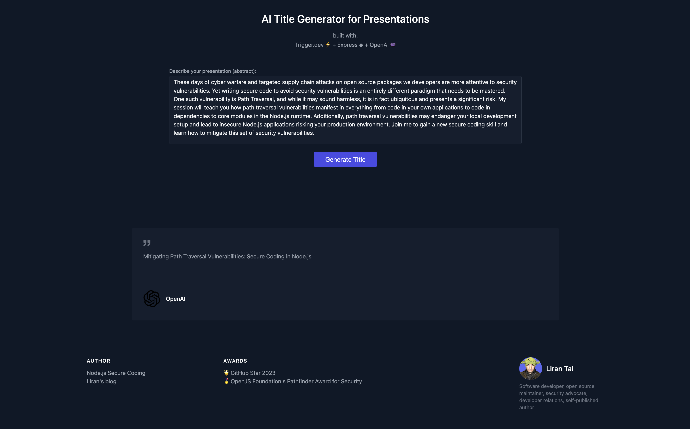

# Trigger.dev Express example job (vanilla)

This project contains an example of how to use [Trigger.dev](https://trigger.dev) with an Express application and provides the server endpoints, a UI for interaction, and a simple OpenAI integration.

> Specifically, this project is nicknamed "vanilla" because it only uses the Trigger.dev SDK and no other official integrations to demonstrate the workflow and processes of how to build a Trigger.dev integration.



## Overview

### Trigger.dev job

The example job is located in the [server.js][./server.js] file.

### API endpoints

The server exposes the following API endpoints:
1. `POST /api/trigger` - This is the endpoint that Trigger.dev will call when a trigger is fired and is used solely to interact with the Trigger.dev API.
2. `POST /api/titles` - This is the endpoint that the UI calls to generate a title using the OpenAI API. It uses the Trigger.dev API to schedule a background task that processes the OpenAI API response. The title isn't immediately returned as this is an asynchronous process.
3. `GET /api/titles` - This is the endpoint that the UI calls every second with a fetch request to check if the background task has completed and a title value exists on the server-side. If it has, it returns the title. If not, it will poll indefinitely.

## Getting Started

To get started, you'll need to have a Trigger.dev account and a Trigger.dev project. You can sign up for a free account at [https://trigger.dev](https://trigger.dev). Once you have an account, you'll need to create a project. You can do this by clicking the "Create Project" button on the [projects page](https://app.trigger.dev/projects).

Pre-requisites:

1. Node.js v18 or higher
2. A Trigger.dev account and project
3. A Trigger.dev API key
4. An OpenAI API key

### Step 1: Git project clone

Clone this repository:

```bash
git clone
cd cd examples/express-vanilla
```

### Step 2: Set up project dependencies

Install dependencies:

```bash
npm install
```

### Step 3: Configure environment variables

Create a `.env` file in the root of the project and add the following environment variables:

```bash
PORT=3000
TRIGGER_API_KEY=your_triggerdev_api_key
OPENAI_API_KEY=your_openai_api_key
```

Or copy over the `.env.sample` file and fill in the values.

### Step 4: Start the server

Start the server:

```bash
npm start
```

At this point, the Express server will run on port 3000 by default and serves the static web page from the `public/` directory. You can change this by setting the `PORT` environment variable.

## Disclaimer

This project's sole purpose is to demonstrate how to use Trigger.dev with an Express application. It is not intended to be used in production and explicitly makes use of naive and rudimentary approaches to provide a functional example. It is not intended to be used as a reference for best practices or production-ready code.

## License

MIT

## Author

(c) Liran Tal <liran@lirantal.com>
