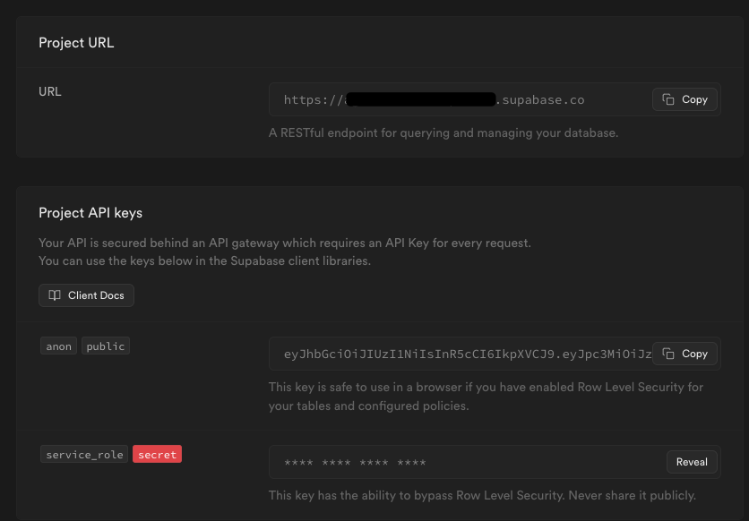
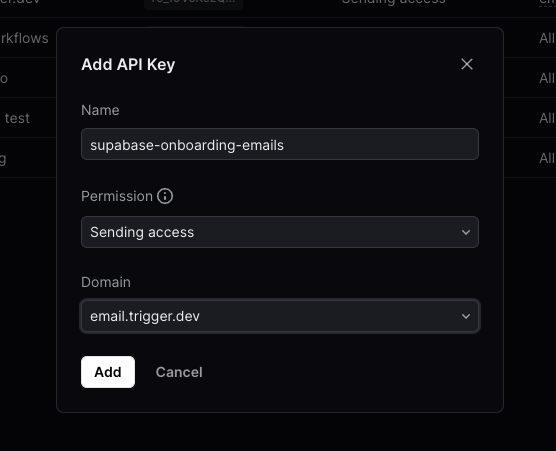
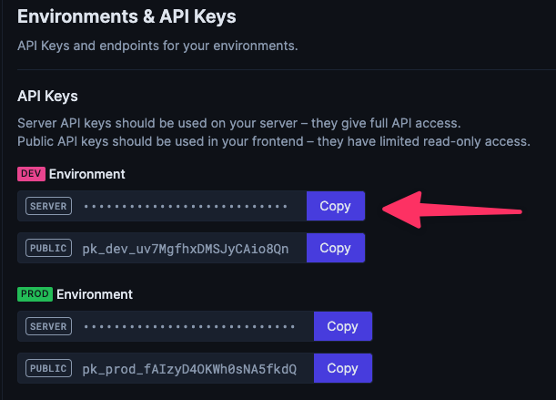
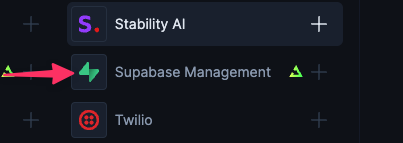
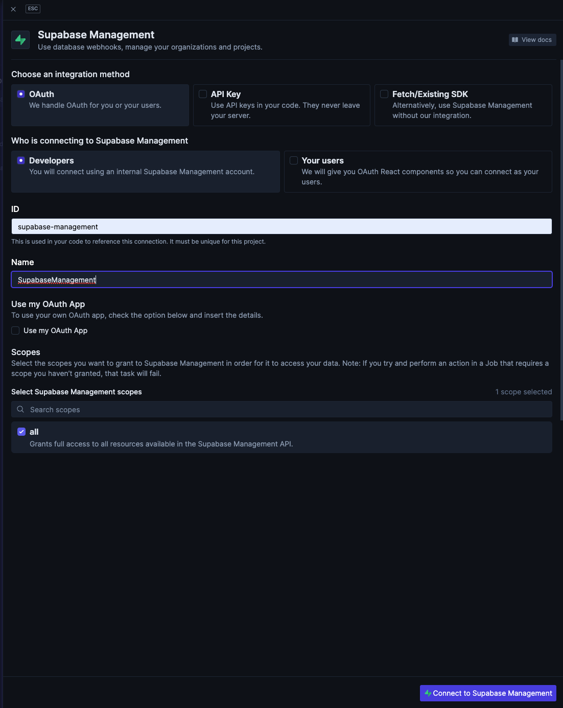
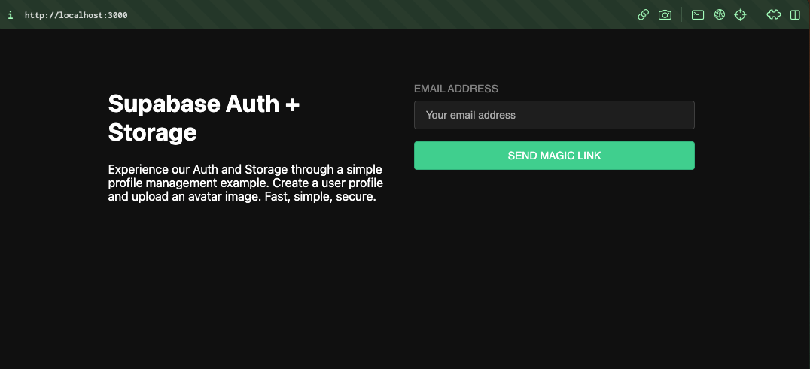
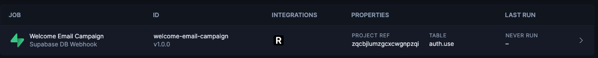
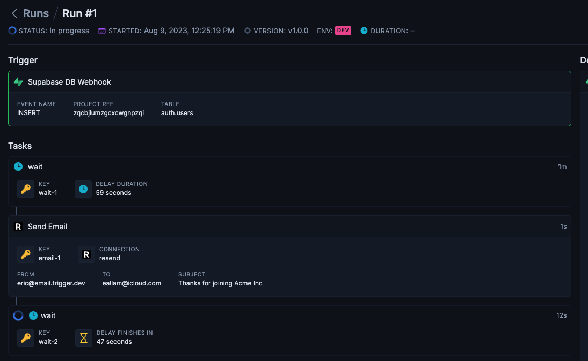

# Supabase 🤝 Trigger.dev - User management starter example

This example is adapted from the [Supabase Next.js Auth & User Management Starter](https://github.com/supabase/supabase/tree/cae0b20cce0ca270a724fcffce83b4a642135323/examples/user-management/nextjs-user-management) and adds additional functionality using [Trigger.dev](https://trigger.dev).

### Example Job: When a user signs up and confirms their email address, they will receive 3 "onboarding" emails over 2 days using [Resend.com](https://resend.com) and [Trigger.dev](https://trigger.dev)

This demonstrates how to use:

- Trigger.dev with Next.js [Quickstart](https://trigger.dev/docs/documentation/quickstart).
- Trigger.dev Supabase integration [triggers](https://trigger.dev/docs/integrations/apis/supabase/management#triggers).
- Trigger.dev [delays](https://trigger.dev/docs/documentation/concepts/delays).
- Trigger.dev [resend integration](https://trigger.dev/docs/integrations/apis/resend).

# Get started

These instructions are adapted from the original [Supabase Next.js Auth & User Management Starter](https://github.com/supabase/supabase/tree/cae0b20cce0ca270a724fcffce83b4a642135323/examples/user-management/nextjs-user-management) with additional instructions for configuring Trigger.dev and Resend.com

## Configure a new Supabase project

### 1. Create new project

Sign up to Supabase - [https://supabase.com/dashboard](https://supabase.com/dashboard) and create a new project. Wait for your database to start.

### 2. Run "User Management" Quickstart

Once your database has started, head over to your project's [SQL Editor](https://supabase.com/dashboard/project/_/sql/templates) and click `Quickstarts`. Scroll down until you see `User Management Starter: Sets up a public Profiles table which you can access with your API`. Click that, then click `RUN` to execute that query and create a new `profiles` table. When that's finished, head over to the `Table Editor` and see your new `profiles` table.

### 3. Get the URL and Key

Go to the Project Settings (the cog icon), open the API tab, and find your API URL, the `anon` key, and the `service_role` key, you'll need these in the next step.

The `anon` key is your client-side API key. It allows "anonymous access" to your database, until the user has logged in. Once they have logged in, the keys will switch to the user's own login token. This enables row level security for your data. Read more about this [here](https://github.com/supabase/supabase/tree/cae0b20cce0ca270a724fcffce83b4a642135323/examples/user-management/nextjs-user-management#postgres-row-level-security).



**_NOTE_**: The `service_role` key has full access to your data, bypassing any security policies. These keys have to be kept secret and are meant to be used in server environments and never on a client or browser.

### 4. Env vars

Copy the `.env.example` file to `.env.local`:

```sh
cp .env.example .env.local
```

And then fill out the Supabase environment variables:

```
NEXT_PUBLIC_SUPABASE_URL="https://<your project id>.supabase.co"
NEXT_PUBLIC_SUPABASE_ANON_KEY="<your anon key>"
SUPABASE_SERVICE_ROLE_KEY="<your service_role secret>
```

## Configure your Resend.com

If you don't already have a Resend.com account, you can create a free account and send up to 3k emails a month: [Resend.com Sign up](https://resend.com/signup). After configuring your sending domain, visit their API Keys page and create a new API Key that allows sending access only:



Copy the API Key and the domain you configured earlier and fill out the following env vars in `.env.local`:

```
RESEND_API_KEY="<resend api key here>"
RESEND_FROM_EMAIL="hi@yourdomain.com"
```

## Configure Trigger.dev

### 1. Get your Trigger.dev API Key

If you don't already have a Trigger.dev account, you can create one [here](https://cloud.trigger.dev/login?redirectTo=%2F). Under the free tier you can do 10k job runs a month.

During signup you'll be asked to create your first Trigger.dev project. Once you've done that, head over to the Project "Environment & API Keys" page and copy the `DEV` environment server key:



Then fill out the `TRIGGER_API_KEY` environment variable in the `.env.local` file.

### 2. Configure Supabase Management Integration

The Trigger.dev `SupabaseManagement` integration that is used in this project to trigger jobs on new user signups makes use of the [Supabase Management API](https://supabase.com/docs/reference/api/introduction) and provides credentials for making requests through their new OAuth implementation.

Head back to your newly created Trigger.dev project in the dashboard and navigate to the "Integrations" page and select the "Supabase Management" integration:



Next, fill out the integration form and make sure to use the ID `supabase-management` so it matches the following code:

```ts
// Use OAuth to authenticate with Supabase Management API
const supabaseManagement = new SupabaseManagement({
  id: "supabase-management",
});
```

It should look like this:



Click on the "Connect to Supabase Management" in the lower-right corner and you'll be redirected to the Supabase OAuth dialog. Make sure to select the Supabase Org you created your Supabase project in above, and then click the "Authorize Trigger.dev" button:


You'll be redirected back to Trigger.dev with your newly created integration. Internally, we store your Supabase Management API access token and refresh token (both encrypted) and we'll provide a working access token whenever a job runs that uses the `supabase-management` integration. For more about integrations and OAuth, see our guide [here](https://trigger.dev/docs/documentation/concepts/integrations)

## Run the application

Run the application: `npm run dev`. This will concurrently run the `next` dev server on port 3000 and the `@trigger.dev/cli dev` command, which will tunnel your Next.js server to Trigger.dev and index any jobs defined.

Open your browser to `https://localhost:3000/` and you are ready to test this Job 🚀.



Enter your email, send the magic link, and once you have clicked the magic link in the email the Job will start running.

Try signing up and then you can head back to the Jobs list in your Trigger.dev project dashboard and you should see your newly created Job:



Click on that and you should see your first run:



# Trigger.dev details

## [`<root>/trigger.ts`](./trigger.ts)

This file configures and exports the `TriggerClient` with the API Key:

```ts
import { TriggerClient } from "@trigger.dev/sdk";

export const client = new TriggerClient({
  id: "supabase-onboarding-emails",
  apiKey: process.env.TRIGGER_API_KEY,
  apiUrl: process.env.TRIGGER_API_URL,
});
```

## [`<root>/supabase-types.ts`](./supabase-types.ts)

This file contains the [Generated Typescript types](https://supabase.com/docs/reference/javascript/typescript-support). You can regenerate them using the following command, making sure to use your own Supabase project ID from above.

> Note: The project ID can be extract from the Project URL. For example, if the project URL is `https://iqzpngwcxcgzmuljbcqz.supabase.co`, then the project ID is `iqzpngwcxcgzmuljbcqz`

```sh
SUPABASE_PROJECT_ID="<your supabase project id>" npm run generate-types
```

## [`<root>/jobs/supabase.ts`](./jobs/supabase.ts)

This contains the bulk of the Trigger.dev code, including:

- The `SupabaseManagement` integration
- The `Resend` integration
- The Supabase triggers
- The Trigger.dev job that runs whenever a user confirms their email address and sends spaced-out welcome emails

```ts
import { client } from "@/trigger";
import { Database } from "@/supabase-types";
import { SupabaseManagement } from "@trigger.dev/supabase";
import { Resend } from "@trigger.dev/resend";

// Use OAuth to authenticate with Supabase Management API
const supabaseManagement = new SupabaseManagement({
  id: "supabase-management",
});

// Using the SupabaseManagement integration, configure an instance of Supabase triggers
// with the generated types imported above, the supabase project URL.
// Internally, this will run a SQL query in your Supabase database that adds a Database Webhook that points to trigger.dev,
// which will eventually become a job run.
const supabaseTriggers = supabaseManagement.db<Database>(
  process.env.NEXT_PUBLIC_SUPABASE_URL!
);

// Resend uses API key auth only, so we just include it here. This API Key is never sent to trigger.dev.
const resend = new Resend({
  id: "resend",
  apiKey: process.env.RESEND_API_KEY!,
});

client.defineJob({
  id: "welcome-email-campaign",
  name: "Welcome Email Campaign",
  version: "1.0.0",
  trigger: supabaseTriggers.onUpdated({
    // Trigger this job whenever a user is confirmed
    schema: "auth",
    table: "users",
    filter: {
      old_record: {
        email_confirmed_at: [{ $isNull: true }],
      },
      record: {
        email_confirmed_at: [{ $isNull: false }],
      },
    },
  }),
  integrations: {
    resend,
  },
  run: async (payload, io, ctx) => {
    if (!payload.record.email) {
      return;
    }

    const isTestOrDev =
      ctx.run.isTest || ctx.environment.type === "DEVELOPMENT";

    // Only wait for 10 seconds when running in as a test or in the development environment
    await io.wait("wait-1", isTestOrDev ? 10 : 60 * 60); // 1 hour

    const email1 = await io.resend.sendEmail("email-1", {
      to: payload.record.email,
      subject: `Thanks for joining Acme Inc`,
      text: `Hi there, welcome to our community! This is the first email we send you to help you get started.`,
      from: process.env.RESEND_FROM_EMAIL!,
    });

    await io.wait("wait-2", isTestOrDev ? 10 : 60 * 60 * 12); // 12 hours

    const email2 = await io.resend.sendEmail("email-2", {
      to: payload.record.email,
      subject: `Here are some tips to get started`,
      text: `Hi there, welcome to our community! This is the second email we send you to help you get started.`,
      from: process.env.RESEND_FROM_EMAIL!,
    });

    await io.wait("wait-3", isTestOrDev ? 10 : 60 * 60 * 24); // 24 hours

    const email3 = await io.resend.sendEmail("email-3", {
      to: payload.record.email,
      subject: "Do you have any questions?",
      text: `Hi there, welcome to our community! This is the third email we send you to help you get started.`,
      from: process.env.RESEND_FROM_EMAIL!,
    });

    return {
      email1,
      email2,
      email3,
    };
  },
});
```

## [`<root>/app/api/trigger/route.ts`](./app/api/trigger/route.ts)

This file uses the `@trigger.dev/nextjs` adapter to export a Next.js App Route at `http://localhost:3000/api/trigger` that exposes the TriggerClient and all the jobs to the Trigger.dev platform, which coordinates with the endpoint to run jobs, handle webhooks, and register triggers.

```ts
import { createAppRoute } from "@trigger.dev/nextjs";
import { client } from "@/trigger";

// Replace this with your own jobs
import "@/jobs/supabase";

//this route is used to send and receive data with Trigger.dev
export const { POST, dynamic } = createAppRoute(client);
```

## How does it work?

Since the Management API has the ability to Run Queries in your Supabase Database, we internally will run the following query to create a Database Webhook on the table specified in the trigger:

```SQL
CREATE OR REPLACE TRIGGER triggername
AFTER UPDATE on "auth"."user"
FOR EACH ROW
  EXECUTE FUNCTION supabase_functions.http_request('https://api.trigger.dev/api/v1/sources/http/abc123', 'POST', '{"Content-type":"application/json", "Authorization": "Bearer ${secret}" }', '{}', '1000')
```

That URL above hits an endpoint on trigger.dev that handles the webhook and immediately responds with a 200. Eventually, Trigger.dev will turn that webhook payload into a Job run if it matches the event filter specified above.

> Note: We will only ever create a single Database Webhook per table in your supabase project. This is to prevent adding unnecessary processing when writing to your database.
